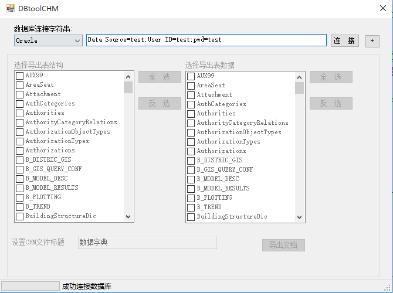

# 数据库备份

这个工具主要是用来对数据做一个简单备份工作。可以备份数据字典还可以备份数据。

## 使用
这个工具使用十分简单，只需要配置一个简单的数据库连接字符串，选择需要备份的对象，导出结果可以得到一个chm文档。

该工具操作界面如下图，              
 

左边选择导出表结构，右边选择导出表数据。

导出chm文件效果如下图，
 

 ## 说明
 这个工具源码比较简单，是多年前一个同事写的，借用一下。

 [源码位置](https://github.com/numsg/software-maintenance/tree/master/02%20src/DBDcoumentCreater)
