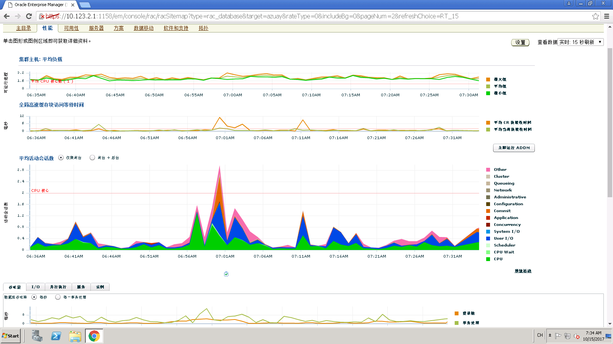
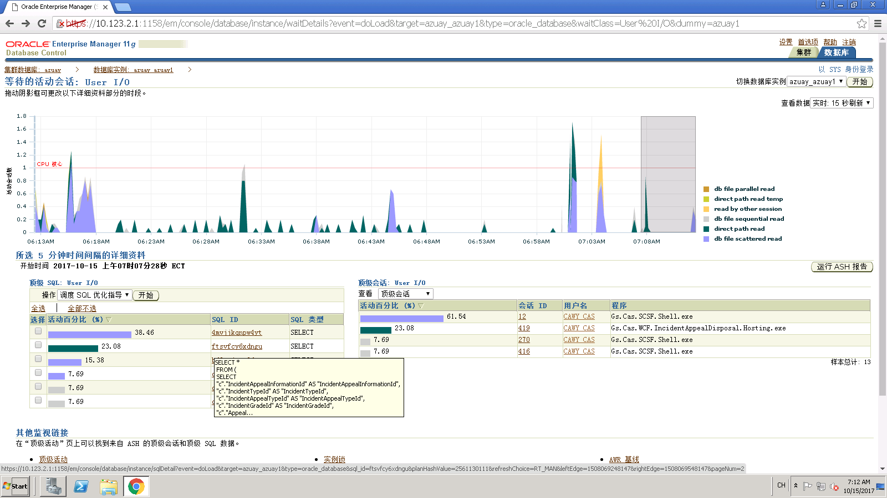

# 数据库性能故障实例

## 背景
在参与某个点升级的过程中，我们的系统升级上线后，系统运行十分缓慢，某些UI操作需要10~20s才能完成。在排除硬件，软件代码，网络等因素后最后将问题定位在数据库运行缓慢上。下面是排查的思路和解决方案。

## 排查思路

1. 关闭数据库其它的一些功能，如OGG，DG，无关紧要的实例。系统依然运行缓慢
2. 重新搭建一套RAC环境，在新的RAC环境，系统依然运行缓慢
3. 检查sql语句(为什么将这个放在最后，因为系统在升级前和升级后sql没有什么变化。)，最后找到一个视图在查询一个大表十分缓慢，另外还有一个大表没有做分区处理，解决这两点，系统运行正常。

下面分享我们当时的处理方法。

### 查看rac节点oracle机器的性能

使用top命令查看，方法其中一个rac解决内存已经使用了99%，并且都是被oracle进程占用了。

### 使用em查看性能较差的sql

登录em，切换到性能TAB页。如下图，

 

注意平均会话数图标，点击右边的User I/O，如下图，

 

 选择rac节点中的实例1（azuay1），点击进入，如下图，

  

其中ftsvfcy6xdngu活动百分比达到23.08%,4mvjjkqnpw4yt活动百分比达到38.46%，且都呈上升趋势。

查看其对应的sql，ftsvfcy6xdngu对应的sql如下图，


查看其对应的sql，4mvjjkqnpw4yt对应的sql如下图，


### 使用PL/SQL查看性能较差的sql

登录PL/SQL,执行sql

```
SELECT * FROM (select PARSING_USER_ID,EXECUTIONS,SORTS, 
COMMAND_TYPE,DISK_READS,sql_text FROM v$sqlarea 
order BY disk_reads DESC )where ROWNUM<10 ; 
```
效果如下图，


结果与em查看的结果一样，但em看到的更加形象化。

到此，问题原因基本找到了：

1. 需要优化视图appealincidentviewmodel的查询
2. 需要优化大表LocationQuery

## 解决方案

视图appealincidentviewmodel，加上大表的分区条件-》时间

大表LocationQuery，加上分区，按分区条件查询。


调整以上两点后，系统运行正常。