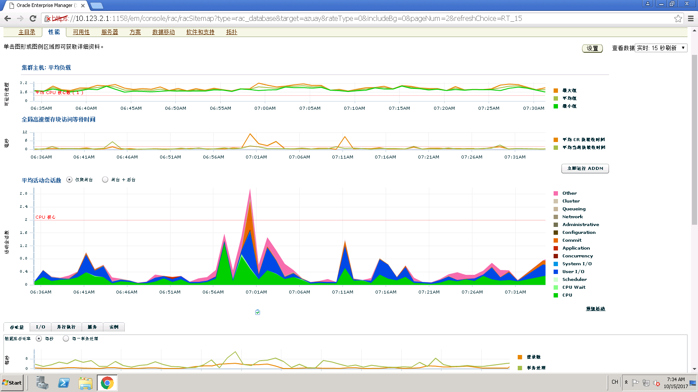
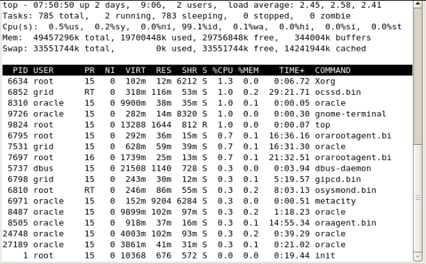
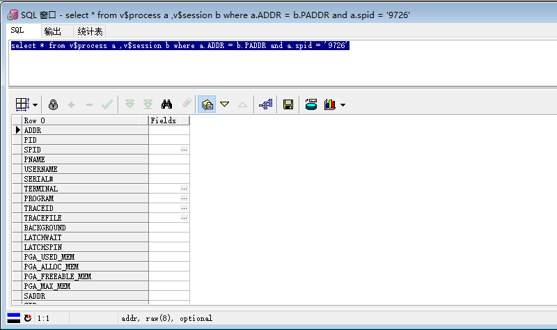

# 数据库性能监视的一些方法

## 背景
在长期运维过程中，由于数据的不断累加，数据库性能优化就显得十分重要。下面就分享下本人在运维过程中对数据库性能检测的一些方法(本人不是DBA)，非常实用。

## 数据库性能监视的方法

### 使用em

方法如下，

首先使用sys用户登录em，选择性能TAB页，如下图，

 

在这里可以查看数据的吞吐量，I/O，并行，平均会话数等一些性能指标。当然还可以查看哪些性能较差的sql。[具体实际应用](https://github.com/numsg/software-maintenance/blob/master/90%20docs/db-sql-1.md)


### 使用数据库客户端(如PL/SQL)

方法如下，

登录PL/SQL，

oracle 查询最近执行过的 SQL语句，

```
select sql_text,last_load_time from v$sql order by last_load_time desc;
 
SELECT   sql_text, last_load_time FROM v$sql WHERE last_load_time IS NOT NULL and sql_text like 'select%' ORDER BY last_load_time DESC;
 
SELECT   sql_text, last_load_time FROM v$sql WHERE last_load_time IS NOT NULL and sql_text like 'update%' ORDER BY last_load_time DESC;
 
SELECT   sql_text, last_load_time FROM v$sql WHERE last_load_time IS NOT NULL and last_load_time like' 14-06-09%' ORDER BY last_load_time DESC;
```

正在执行的
```
select a.username, a.sid,b.SQL_TEXT, b.SQL_FULLTEXT
  from v$session a, v$sqlarea b 
where a.sql_address = b.address 
```

执行过的（此方法好处可以查看某一时间段执行过的sql，并且 SQL_FULLTEXT 包含了完整的 sql 语句）
```
select b.SQL_TEXT,b.FIRST_LOAD_TIME,b.SQL_FULLTEXT
  from v$sqlarea b
where b.FIRST_LOAD_TIME between '2017-9-15/09:24:47' and
       '20017-9-15/09:24:47' order by b.FIRST_LOAD_TIME 
```

查找前十条性能差的sql
```
SELECT * FROM (select PARSING_USER_ID,EXECUTIONS,SORTS, 
COMMAND_TYPE,DISK_READS,sql_text FROM v$sqlarea 
order BY disk_reads DESC )where ROWNUM<10 ; 
```

查看占io较大的正在运行的session 
```
SELECT se.sid,se.serial#,pr.SPID,se.username,se.status, 
se.terminal,se.program,se.MODULE,、se.sql_address,st.event,st. 
p1text,si.physical_reads, 
si.block_changes FROM v$session se,v$session_wait st, 
v$sess_io si,v$process pr WHERE st.sid=se.sid AND st. 
sid=si.sid AND se.PADDR=pr.ADDR AND se.sid>6 AND st. 
wait_time=0 AND st.event NOT LIKE '%SQL%' ORDER BY physical_reads DESC
```

### 结合Linux命令及PL/SQL查看

登录数据库机器，使用top命令查看机器性能，找到占用机器CPU或者内存高的oracle进程的PID，使用SQL语句去数据库查询。

方法如下，使用top命令查看，如下图，

 

 再使用PLSQL 查看PID对应的那个客户端机器

 执行sql
 ```
 select * from v$process a ,v$session b where a.ADDR = b.PADDR and a.spid = '9635'
 ```

 效果如下图，
 


好了，说了这么监控数据库性能的一些手段，有人会怀疑了，这些真的有用吗？是的，这些是真的有用，[下面再分享一次系统因数据库运行缓慢故障解决方案]((https://github.com/numsg/software-maintenance/blob/master/90%20docs/db-sql-1.md))。