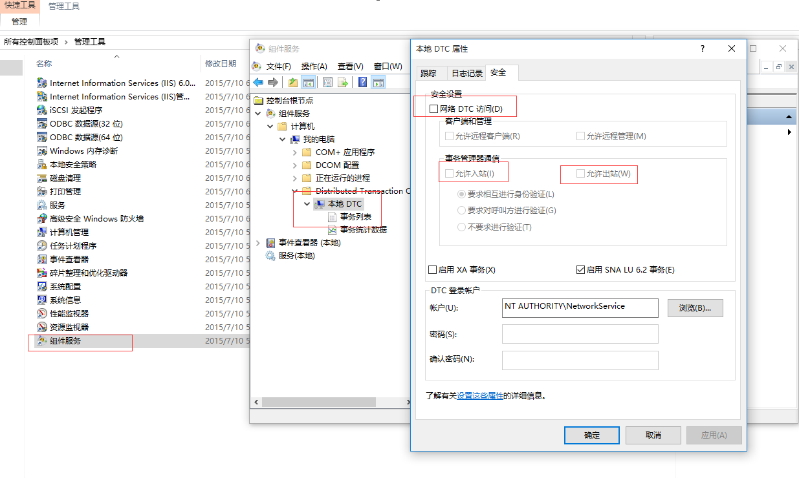

# 分布式事务问题

在我们开发中，对数据库的一些操作，经常会用到一些分布式事务，但正因为这，我们会遇到一些很奇怪的问题。

如问题如下图，
 

 没错，这个就是一个分布式事务问题。

## 解决方案

1. 卸载msdtc服务，打开控制台，执行msdtc -uninstall
2. 安装msdtc服务，执行msdtc -install
3. 打开“管理工具――组件服务”，以此打开“组件服务――计算机”，在“我的电脑”上点击右键。在MSDTC选项卡中，点 击“安全配置”按钮。在安全配置窗口中做如下设置：选中“网络DTC访问” 　在客户端管理中选中“允许远程客户端”“允许远程管理” 　　在事务管理通讯中选“允许入站”“允许出站”“不要求进行验证” 即可，如下图，
 
设置完成后，再执行分布式事务相关操作，就不会报错了。