# 使用.netreflector修改代码

引入dll注入，修改代码

优点：
1.	不需要关注代码版本
2.	操作比较简单，能很轻松修复系统BUG
3.	对dll强引用没有任何问题

使用工具：
1. .netreflector 8.3.0.95
2. 其中插件Reflexil v1.8

## Dll注入修改代码步骤

例如，代码行如下，
 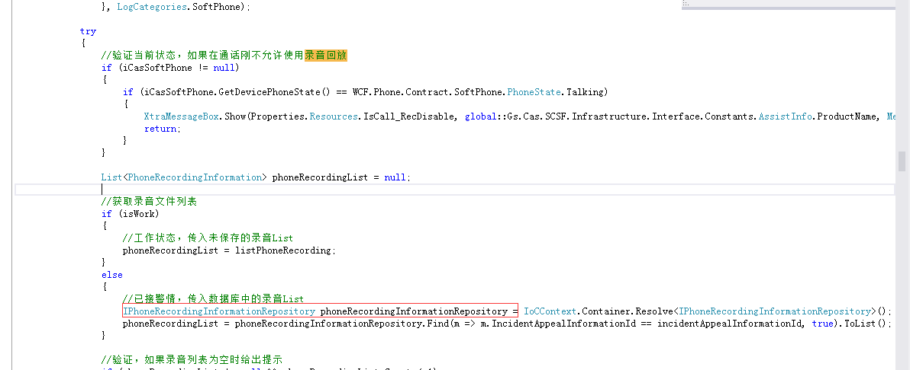

需要将phoneRecordingInformationRepository修改成成员变量。
步骤如下：
1.	用.netreflector打开Gs.Cas.SCSF.IncidentAppealModule.dll
2.	添加类成员变量
 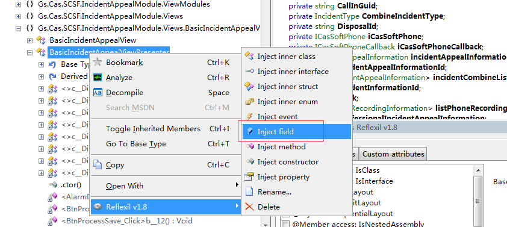
3.	添加完成后，修改代码如下图，
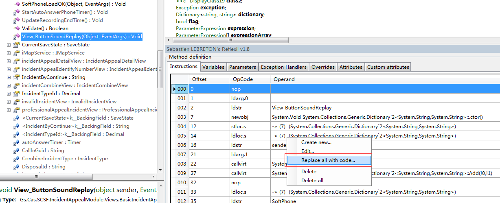
4.	修改方法，在里面添加响应的代码
 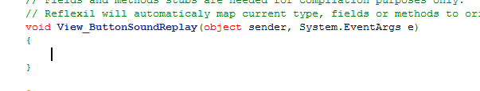
5.	替换dll引用         
  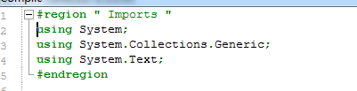
6.	并且注意类之间的继承关系，
 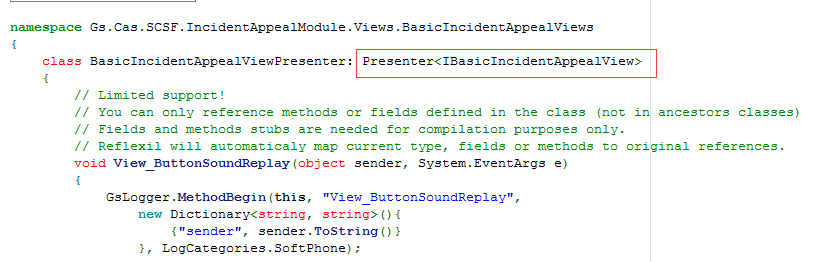
7.	点击编译，成功后，点击ok
 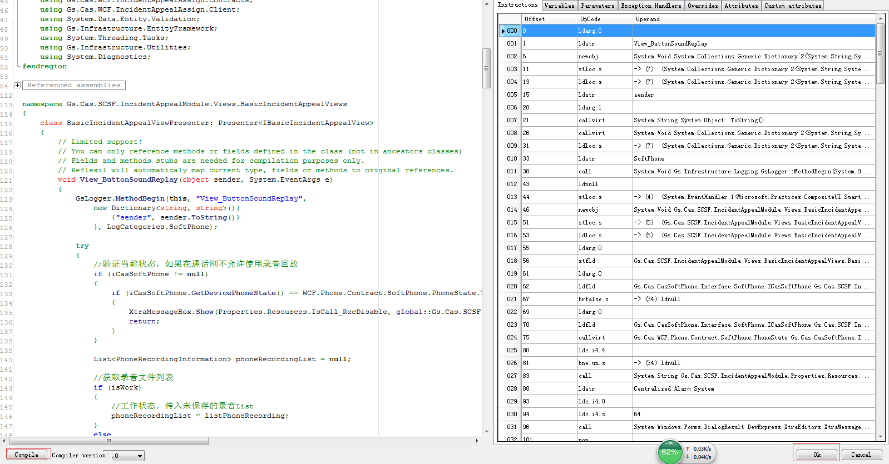
8.	然后另存为，保存dll即可。
 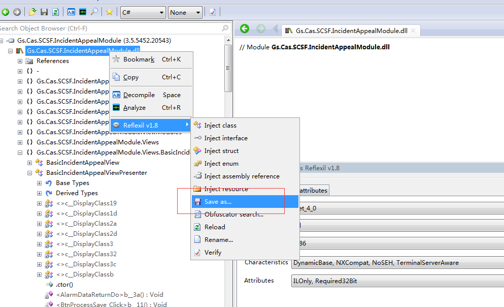
9.	在保存的dll里面发现多了一个未知的引用  
 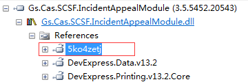
10.	先找到这个类的对象    
 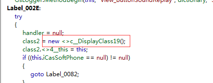
11.	用.net Reflector再次打开最新的即可，打开对象初始化的地方
 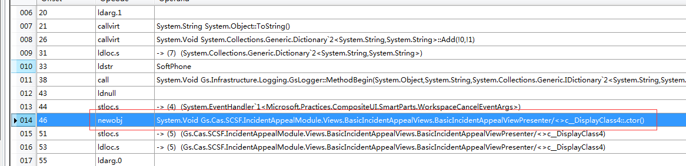
12.	移除这个引用    
 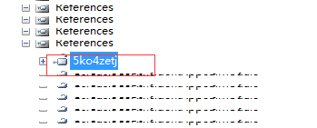
13.	将变量修改成对应的变量引用即可
14.	最后再次保存为dll

## 注意

1. 引用程序集必须是全路径
2. 注意变量的引用

