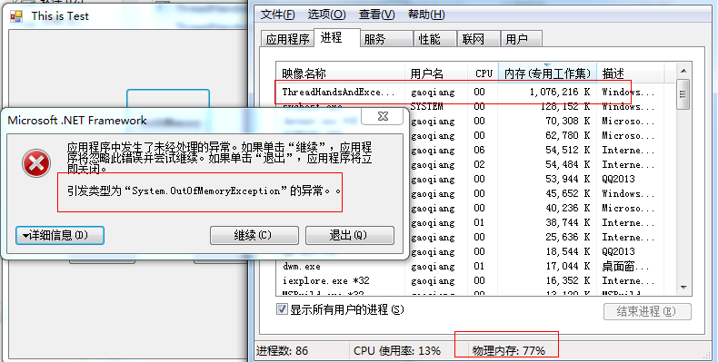

# 内存溢出的解决方案

## 什么是内存溢出
指程序在运行的过程中，程序对内存的需求超过了计算机分配给程序的内存，从而造成“Out of memory”之类的错误，使程序不能正常运行。
## 造成内存溢出有几种情况
1. 软件程序的问题，程序在运行时没能及时释放不用的内存，造成使用的内存越来越大从而造成内存溢出。对于这种情况，可以修改程序的代码来解决。
2. 计算机本身的内存小，当同时运行多个软件时，计算机得内存不够用从而造成内存溢出。对于这种情况，只能增加计算机内存来解决。
3.	针对运行32位应用程序，而大型系统启动时必须的内存超过1G或者在程序运行过程中维持应用程序正常运行的最大内存超过1G时，可以提升应用程序内存来解决。

## 针对以上几种情况的解决方案
针对软件问题的解决方案
1.	去除程序中未退订的事件。
2.	去除程序中很复杂的静态变量。
3.	释放程序中非托管的资源（如Bitmap、Graphics等）。
4.	对于大的对象控制好其生命周期。
5.	减少读取数据到内存的的数量（当一个查询语句查询出来的数据量很大，达到几百万条数据时存放到datatable 或dataset中也会造成内存溢出，这是可以采用分页查询等其他方法来解决）。
6.	去除程序中的死循环，因为有些死循环在不断申请内存（包括子线程的）。

## 针对计算机本身内存小的解决方案
这个只能通过提升硬件来解决此问题

## 内存溢出第三种解决方案

### 应用背景
目前我们的客户端都是32位应用程序，

### 局限
1.	一般的32位操作系统提供给用户地址最大都是3g（操作系统自己保留1g），windows由于商业目的，对于个人用户只提供了2g地址（甚至不到2G）。
2.	.net应用程序GC在工作时，需要分配固定的一部分内存，导致真正分配给我们应用程序的内存不到1G。

### 问题
ECU911系统是个很复杂庞大的业务系统，超1G内存的消耗也是很正常的。所以经常性出现内存溢出。

#### 解决方案一
既然我们找到了问题出现的原因，想解决它就很简单了。解决这个问题的主要技术路线是提升应用程序的内存，也就是应用程序的寻址空间，如果把我们应用程序都改成64位，那么就没有这个问题了。
但是这种方案对我们目前的情况来看是不可能的了。

#### 解决方案二
我们试想，能不能提升改变我们32位应用程序的寻址方式，让它拥有2G以上的寻址空间，那么这个问题不就解决了么。
我们来看一个简单的例子。代码如下，
   
大家都知道，这样的代码必然会导致内存溢出的。运行后结果如下图。
  
我们改变此应用程序的寻址方式。
操作步骤如下，
运行软件 [authorizetool](https://github.com/numsg/software-maintenance/blob/master/01%20tools/authorizetool.zip)（这里我们对外称，我们是对我们的软件在进行授权！）

找到我们的exe
   
打开即可，              
   

到此我们已经改变了我们应用程序的寻址方式。点击OK即可。
到此，我们再去运行我们的应用程序，如下图，
    
应用程序不再抛出OutOfMemery了，并且应用程序的的内存占用达到2G以上。系统也不会弹出异常而跨。

## 注意
在做操作之前要记得备份我们的exe(运维人员的必备好习惯)。

## 结束语
针对以上的第三种解决方案，以前在大型项目中有用过的案例，并且运行用得还蛮好，着实解决了内存溢出的问题。
以经验保证，这个是不会对我们的应用程序有任何的损害。
