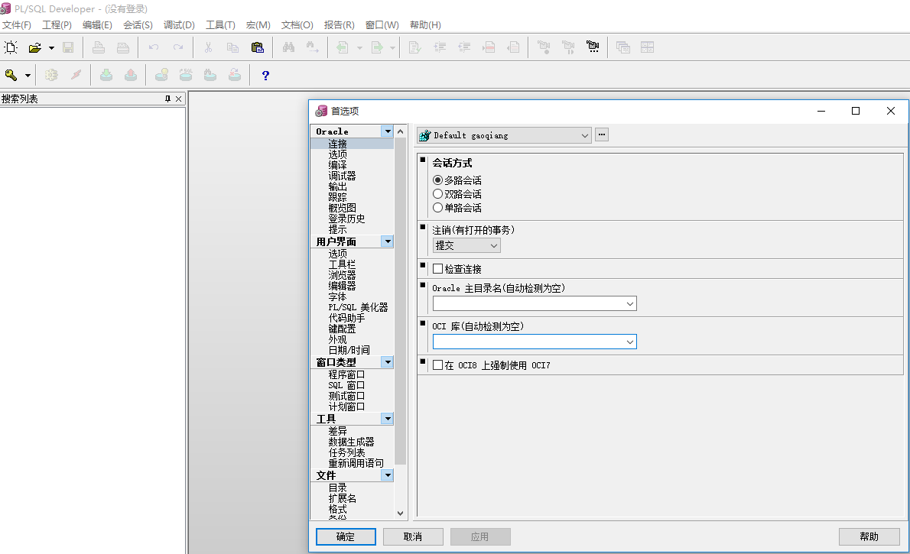

# PLSQL 登录时一直卡住

今天客户(客户是个技术员)一台客户端机器在登录PLSQL的时候，卡住在登录界面。然而客户又跟我演示他使用sqldeveloper可以登录进行操作数据库。并且还告诉我使用PLSQL以前是可以登录的。

说到这，大概就知道问题的原因了。

猜想： 安装sqldeveloper后使得PLSQL访问数据库的环境发生了变化。

解决方案：
1. 打开PLSQL，别进行登录，直接取消。
2. 打开PLSQL窗口后，找到 工具-》首选项-》连接，设置好OCI库，如下图
 
3. 找到你对应安装的ORACLE Client路径即可。
4. 设置完成后，关闭PLSQL，再打开PLSQL，登录，问题解决。
