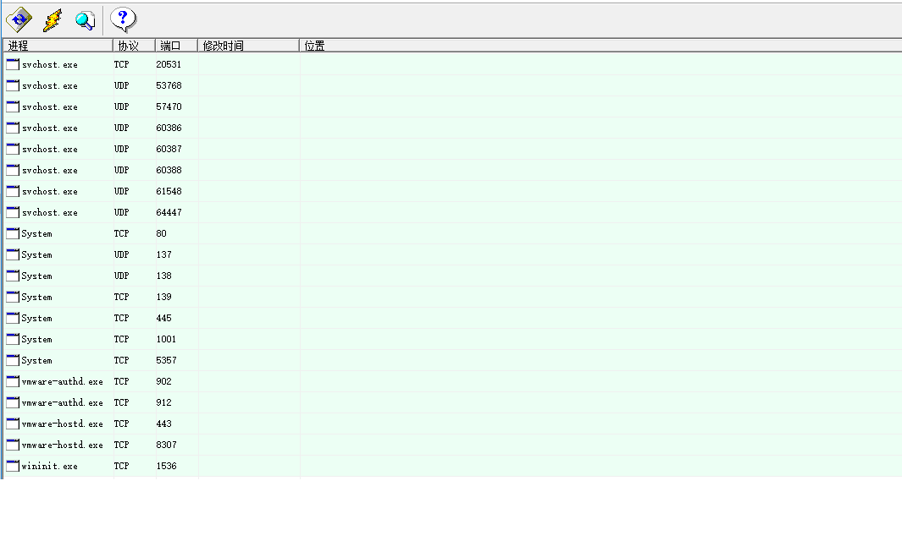

# 端口问题处理

在一线运维过程中，我们经常会遇到端口被占用的情况。

如一次服务部署过程中，发现服务调用Arcgis失败，地图无法显示。日志有无法提供一些有用的信息。

检查发现：GIS服务地址http://localhost:80/arcgis/rest/services/xxx/MapServergis服务负载均衡用80端口。

而服务器上，我们安装了iis，iis里面有个默认网站占用了80端口，导致端口冲突，gis服务无法使用。

此时，我们可以使用PortViewer工具，查看系统端口的使用情况。如下图，

  

  有了这个工具，我们可以快速定为哪些应用或者服务使用了哪些端口。
