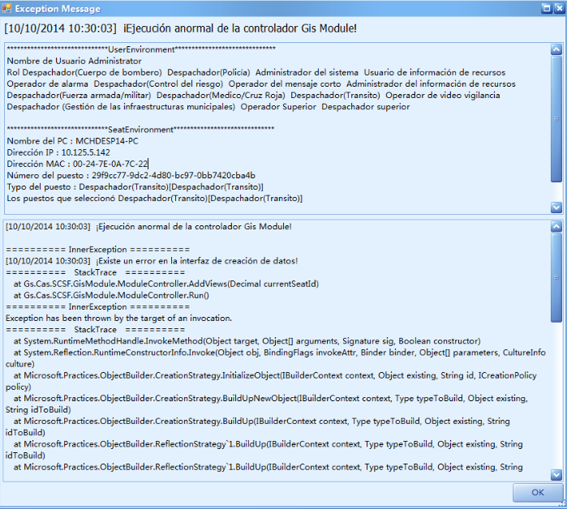
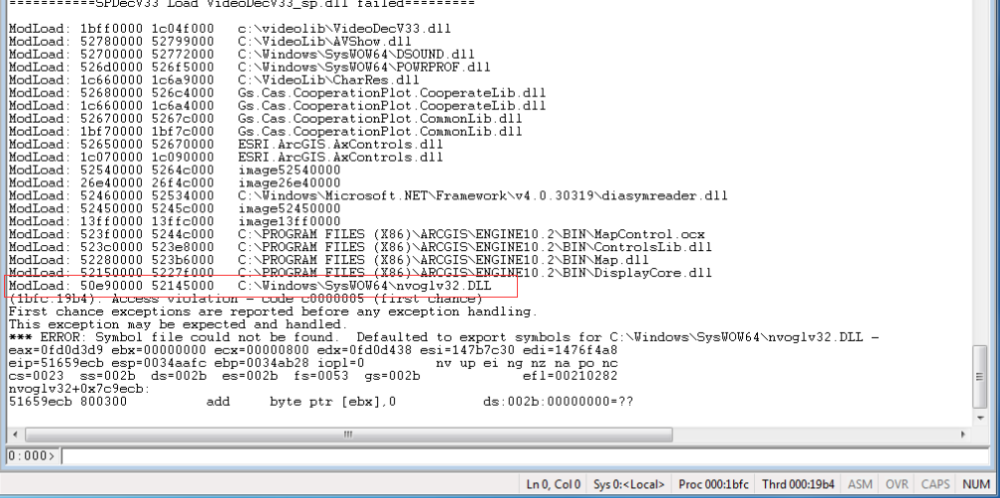
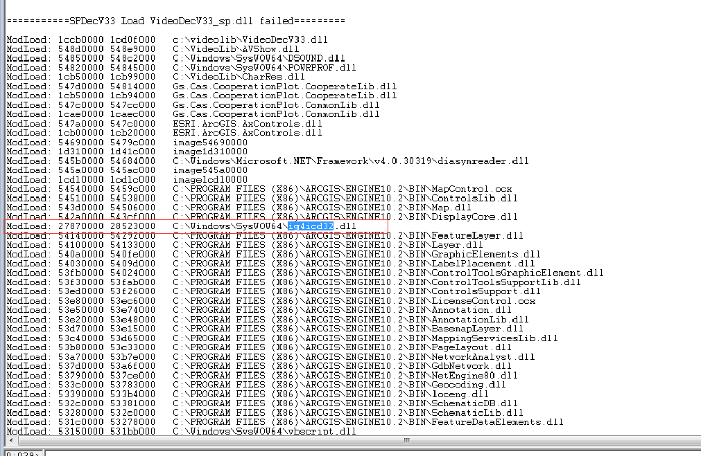

# windbg系列之分析访问受保护的内存

## 背景
在升级machala客户端中，发现有一台客户端的在所有环境都安装OK的情况下，启动客户端，出现GisModule访问受保护的内存情况。如下图，
  
 
## 问题分析
在所有安装的客户端中，安装步骤都是一样的。只不过出现此问题的客户端上安装的环境比较复杂。
开始尝试卸载一些与911客户端无关的软件，此问题依然存在。
去掉一些无关的环境变量，此问题依然存在。

## 用windbg分析问题

### 第一步分析此台不正常的客户端
在此台客户端上用windbg进行分析。
在模块加载到nvoglv32.DLL报错。
   

### 第二步分析一台正常的客户端
在此台客户端上用windbg进行分析。发现没有在相同的位置加载的库不相同。
    
    
## 解决方案
由于二台电脑用了不同的动态链接库导致的，在出错的客户端拿掉nvoglv32.dll，再启动911，OK，系统运行正常。
