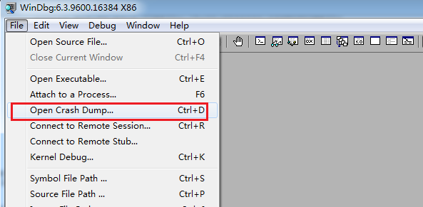
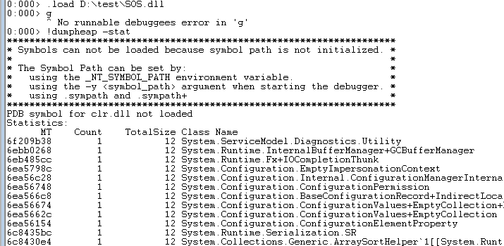
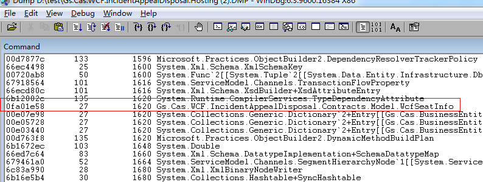
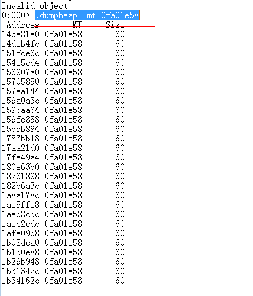
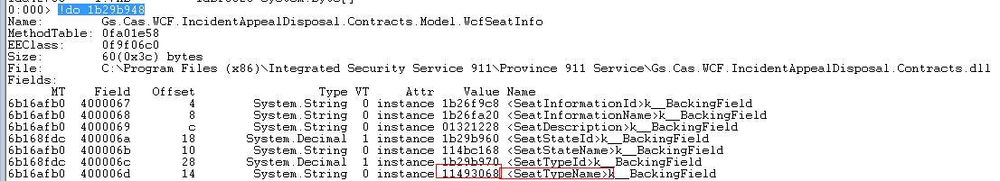
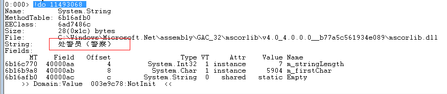
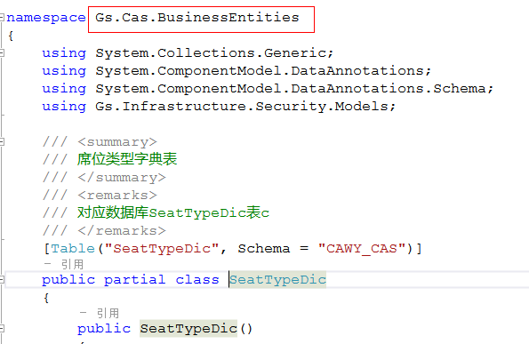

# windbg系列之查看内存对象的值

## 背景
基于在升级xx中心的环境下，出现如下问题。
在接警席位进行电话转接，弹出转接席位选择的时候，出现处境席位是中文的情况。

## 问题分析
因为席位的状态接处警席位服务维护的，可能是服务端推送过来的源数据有问题。对接处警WCF服务国际化检查，国际化配置是正确的。初步怀疑是服务器维护的对象WcfCombinedInfo有问题。

## 用windbg分析问题

### 第一步提取Dump文件
打开任务管理器，切换到进程Tab页，
 
 
点击创建转存储文件。
然后拷贝出生成的DMP文件。
这里需要注意的是：我们服务是64位系统，默认启动的任务管理器是64位的，生成的DMP文件也是64位的，但是本人安装的windbg是32位的，32位windbg程序是无法分析64的DMP文件的。解决方案有二种：

①启动32位任务管理器，命令如下，在命令行执C:\Windows\SysWOW64\taskmgr.exe。

②用工具将64位的DMP转换成32位。

### 第二步分析Dump文件
利用windbg分析DMP文件。

①  打开windbg，Open Crach Dump，加载我们的DMP文件，
Gs.Cas.WCF.IncidentAppealDisposal.Hosting .DMP
  

②	加载拓展调试库，
.load C:\Windows\Microsoft.NET\Framework\v4.0.30319\sos.dll。其中注意.net的版本，需与生成DMP文件的机器环境FrameWork保持一致。（在这里就不需要加载调试符号了，这个会在另外的章节讲）

③	输入!dumpheap –stat(查看内存所有对象)
  

④	找到存储我们席位状态的对象，WcfSeatInfo这个类型对象对应的地址0fa01e58
  

⑤	执行!dumpheap -mt 0fa01e58，找到每个WcfSeatInfo对象对应的地址
  

⑥	选择其中任意一个地址，如1b29b948，执行!do 1b29b948，查看对象的状态及基本信息
  

⑦	根据上图可以找到SeatTypeName的value  11493068

⑧	再次!do 11493068，如下图。可以找到这个对象的SeatTypeName的值是“处警员（警察）”
   

⑨	到此，我们可以得出结论，应该是源头出现问题，BusinessEntities的静态数据出现问题。而服务器又配置了西语环境，最大的可能就是es-EC下的
Gs.Cas.BusinessEntities.resources.dll没有打包进去。
 
   

到此结束。
