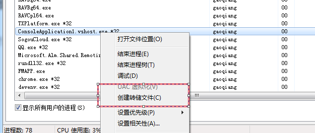
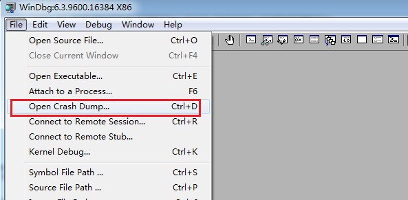
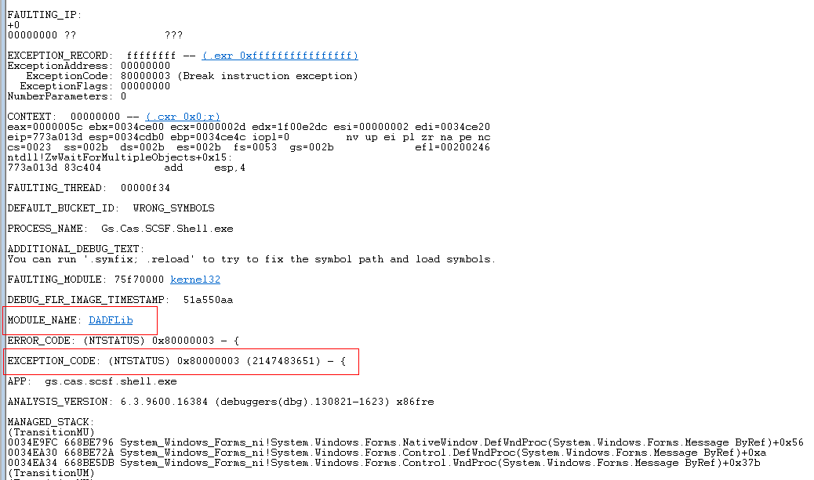
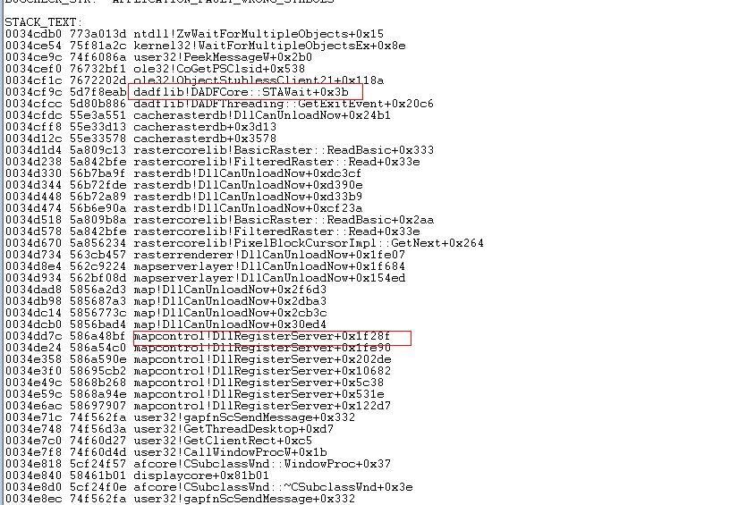
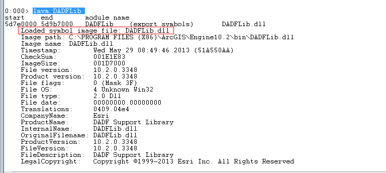
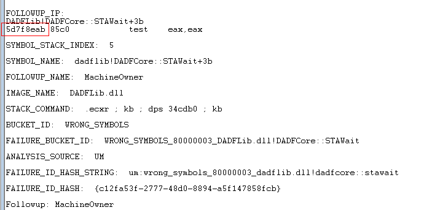
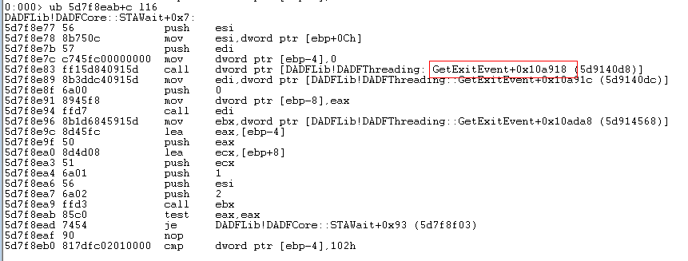

# windbg系列之分析程序UI卡住

## 背景
基于在升级ambato的环境下，出现如下问题。
在刚升级的客户端在操作GIS的时候出现UI卡死的现象。

## 问题分析
怀疑是gis下载数据时导致UI线程卡死。

## 用windbg分析问题
这种情况下，我们使用windbg来对应用程序卡住时的线程进行分析。

## 第一步提取Dump文件
打开任务管理器，切换到进程Tab页，提取我们客户端程序的内存镜像文件。
  
点击创建转存储文件。
然后拷贝出生成的DMP文件。
这里需要注意的是：我们客户端是64位系统，默认启动的任务管理器是64位的，生成的DMP文件也是64位的，但是本人安装的windbg是32位的，32位windbg程序是无法分析64的DMP文件的。解决方案有二种：①启动32位任务管理器，命令如下，在命令行执行C:\Windows\SysWOW64\taskmgr.exe。②用工具将64位的DMP转换成32位。
## 第二步分析Dump文件
利用windbg分析DMP文件。

①	、打开windbg，Open Crach Dump，加载我们的DMP文件，
Gs.Cas.WCF.IncidentAppealDisposal.Hosting .DMP
  

②	加载拓展调试库，
.load C:\Windows\Microsoft.NET\Framework\v4.0.30319\sos.dll。其中注意.net的版本，需与生成DMP文件的机器环境FrameWork保持一致。（在这里就不需要加载调试符号了，这个会在另外的章节讲）

③	输入!analyze -v (dump文件分析)
  

④	再看堆栈信息
  

⑤	执行lmvm DADFLib，查看dll详细信息
  

可以看到这个dll的功能是加载图片符号的。预测gis服务器获取图片符号出现了问题。
⑥	 执行ub 5d7f8eab+c l16，查看
WRONG_SYMBOLS_80000003_DADFLib.dll!DADFCore::STAWait，卡住UI附近的代码。
  
  

 
这段汇编代码大致意思:
在调用GetExitEvent()时卡住。主线程在等待信号量状态变化然后继续往下执行。

## 建议
建议能不能在封装取GIS数据的时候异步做，不卡住UI主线程。
